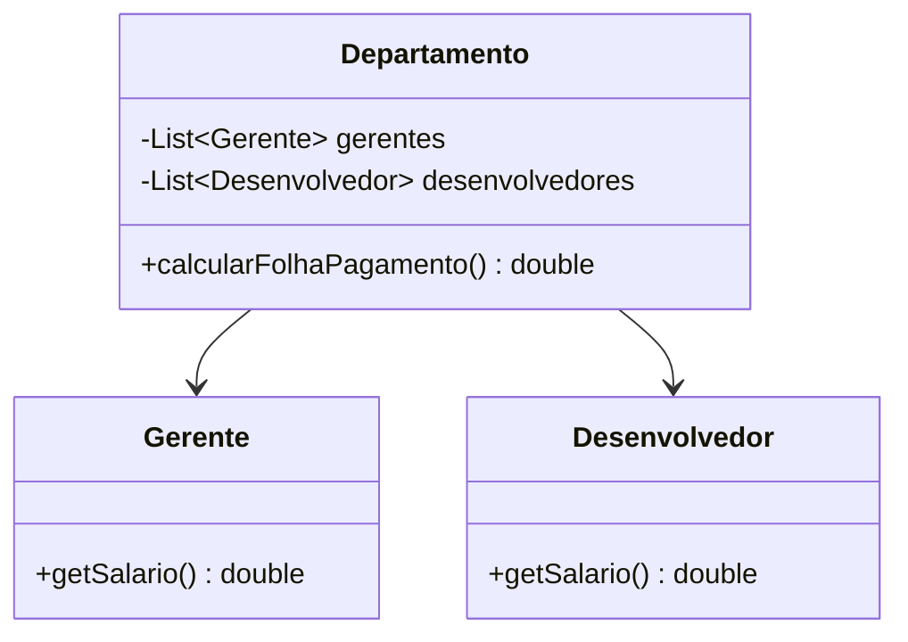
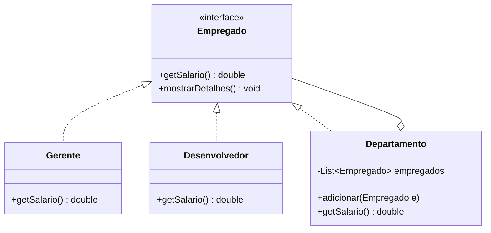

# Padrão de Projeto Composite

Este projeto demonstra a aplicação do padrão Composite para gerenciar uma estrutura organizacional de funcionários e departamentos.

## O Problema (Anti-padrão)
No anti-padrão, a classe `Departamento` precisa gerenciar listas específicas para cada tipo de funcionário (`Gerente`, `Desenvolvedor`). Se um novo cargo for criado, a classe `Departamento` precisará ser modificada para suportar a nova lista e incluí-la no cálculo da folha de pagamento.

### Diagrama UML Anti-padrão


## A Solução (Padrão Composite)
O padrão permite tratar objetos individuais (`Desenvolvedor`, `Gerente`) e composições de objetos (`Departamento`) de forma uniforme através de uma interface comum (`Empregado`).

### Diagrama UML Padrão


## Como Executar
Navegue até a pasta `composite/antipadrao` ou `composite/padrao` e execute:
```powershell
mvn compile exec:java -Dexec.mainClass="com.example.composite.antipattern.Main"
# ou
mvn compile exec:java -Dexec.mainClass="com.example.composite.pattern.Main"
```
