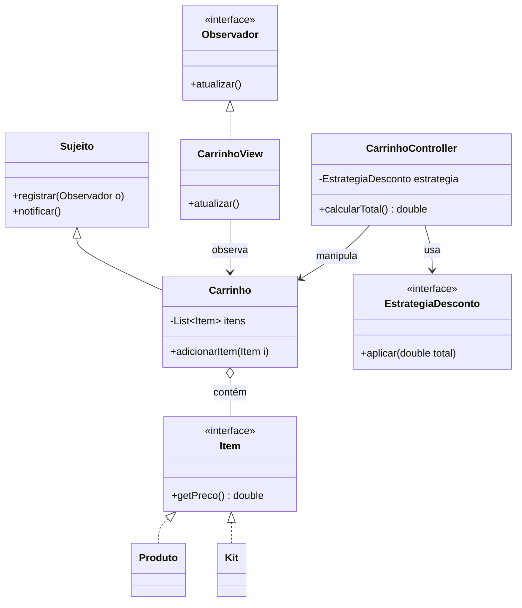

# Projeto MVC (Strategy + Observer + Composite)

Este projeto demonstra a integração de três padrões de projeto clássicos em uma arquitetura MVC (Model-View-Controller) simplificada para um sistema de Carrinho de Compras.

## Integração dos Padrões

1.  **Observer (Model ↔ View):** O `Carrinho` (Model) estende `Sujeito` e notifica a `CarrinhoView` sempre que um item é adicionado.
2.  **Composite (Model):** O `Carrinho` armazena objetos do tipo `Item`. Um `Item` pode ser um `Produto` (simples) ou um `Kit` (composto por vários produtos).
3.  **Strategy (Controller):** O `CarrinhoController` utiliza a interface `EstrategiaDesconto` para aplicar diferentes regras de preço (ex: desconto à vista) sem mudar a lógica do carrinho.

## Diagrama UML Integrado


## Como Executar
Navegue até a pasta `mvc` e execute:
```powershell
mvn compile exec:java -Dexec.mainClass="com.example.mvc.Main"
```
