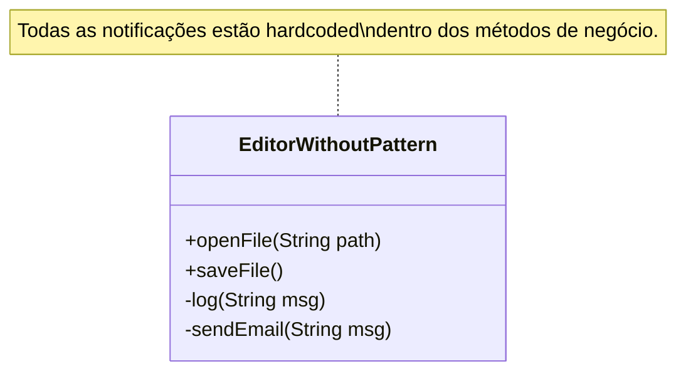
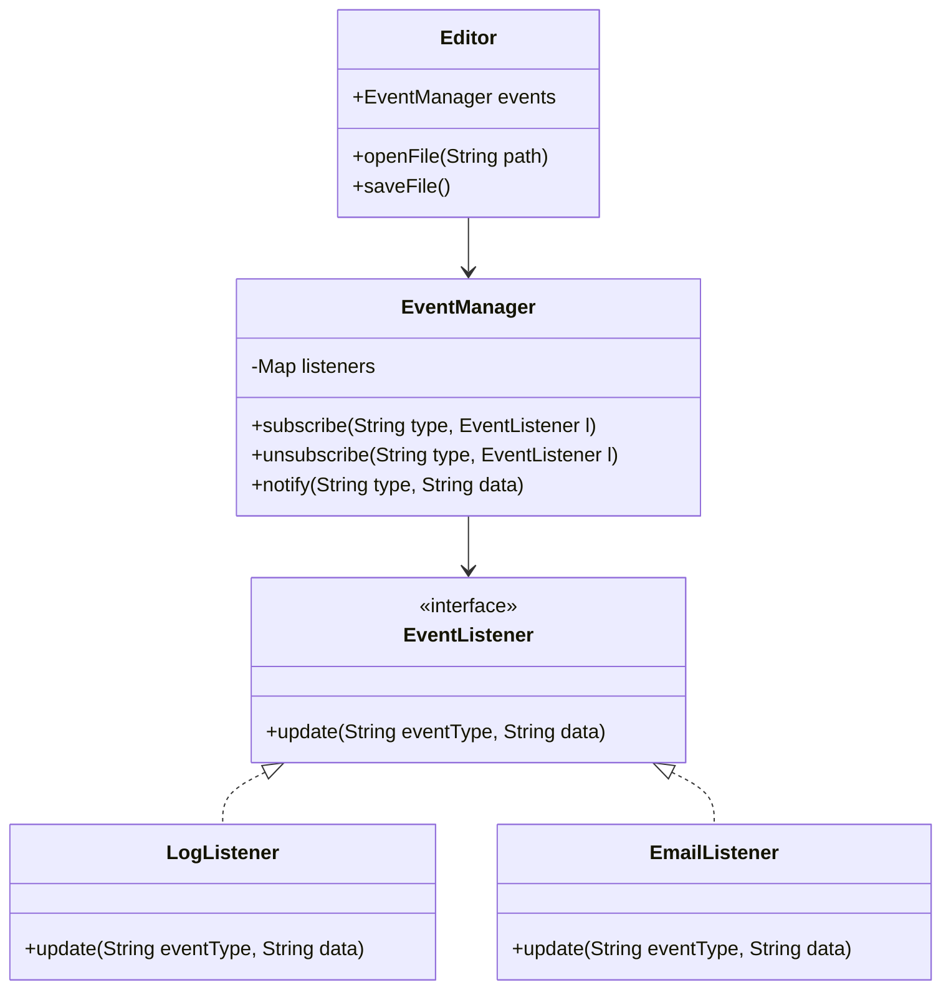

# Padrao de Projeto Observer (Livraria)

Este projeto demonstra a implementacao do padrao Observer em um sistema de gerenciamento de livraria com interface grafica (Swing).

O objetivo e mostrar como notificar diferentes sistemas (Estoque, Marketing, Auditoria) quando um novo livro e adicionado, comparando uma abordagem rigida (Antipadrao) com uma flexivel (Padrao).

## O Problema

Em um sistema de livraria, quando um novo livro chega, varias acoes devem ocorrer:
* O sistema de estoque deve ser atualizado.
* O marketing deve enviar newsletters.
* O sistema de auditoria deve registrar a operacao.

No **Antipadrao**, todas essas chamadas estao dentro do codigo principal da Livraria. Se quisermos parar de enviar newsletters, precisamos alterar e recompilar o codigo do sistema principal.

No **Padrao**, a Livraria apenas emite um "evento". Quem estiver interessado (Estoque, Marketing) se inscreve para ouvir esse evento. Podemos ligar ou desligar notificacoes em tempo de execucao sem mexer no codigo da Livraria.

## Estrutura

### Diagrama Anti-padrão (Observer)
No anti-padrão, o editor está fortemente acoplado às implementações de log e e-mail.



### Diagrama Padrão (Observer)
O uso do `EventManager` desacopla o publicador (`Editor`) dos seus assinantes.



## Como Executar

Navegue ate a pasta desejada e execute:

```powershell
mvn compile exec:java
```
