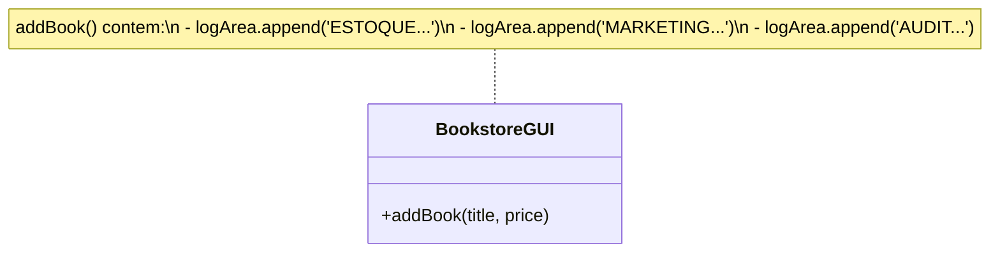

# Observer Antipadrao (Livraria)

Nesta versao da livraria, a classe BookstoreGUI esta fortemente acoplada aos sistemas de notificacao (Estoque, Marketing, Auditoria).

## Funcionamento

Ao adicionar um livro, o codigo da interface chama diretamente as outras funcoes. O problema e que, para adicionar um novo sistema (ex: Log de Vendas), e necessario editar o codigo da interface. Alem disso, nao ha como parar de notificar um sistema sem remover o codigo e recompilar.

## Diagrama UML

## Problemas Identificados

* Rigidez: As notificacoes estao fixas no codigo.
* Acoplamento: A Livraria conhece todos os sistemas interessados nela.
* Violacao do Aberto/Fechado: Qualquer mudanca requer editar a classe principal.
