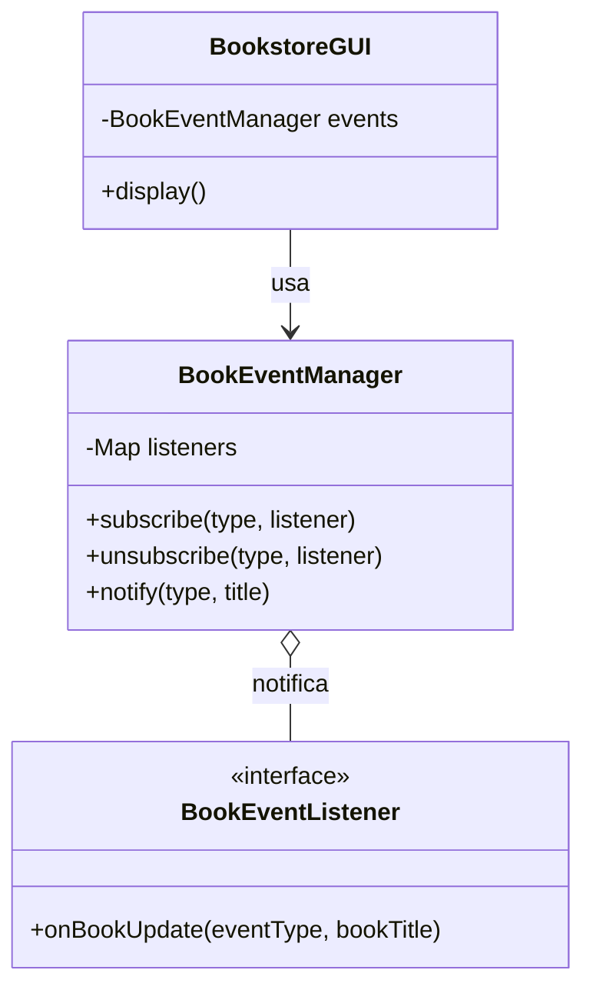

# Observer Padrao (Livraria)

Nesta versao da livraria, o codigo principal apenas emite eventos. Quem esta interessado se inscreve e reage ao evento de forma independente.

## Funcionamento

Utilizamos o padrao Observer para criar um sistema de assinaturas. A BookstoreGUI emite um sinal de que um livro foi adicionado. Os sistemas (Estoque, Marketing) sao assinantes desse sinal. O gerenciador de eventos (BookEventManager) distribui esse sinal para quem estiver na lista.

Ao marcar ou desmarcar os checkboxes na interface, voce esta adicionando ou removendo assinantes em tempo real, sem alterar o codigo principal.

## Diagrama UML

## Vantagens Identificadas

* Desacoplamento: A Livraria nao sabe quem a observa.
* Flexibilidade: Assinaturas em tempo de execucao.
* Extensibilidade: Novos sistemas podem ser criados sem mudar o codigo da livraria.
