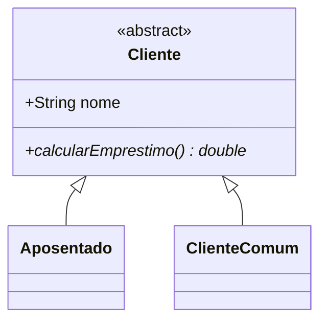
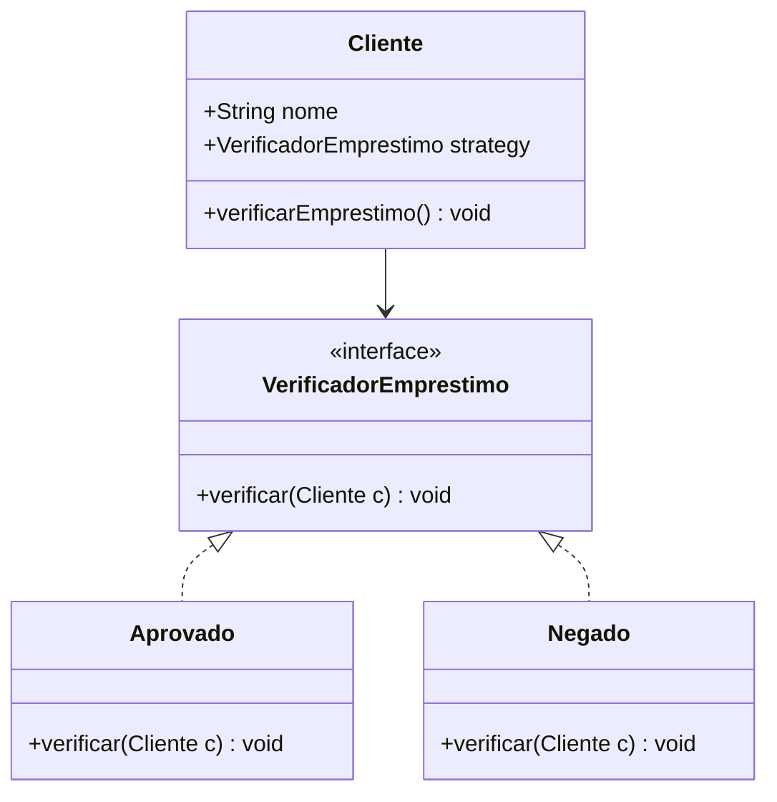

# Diagramas de Classe (Simplificados)

### Anti-padrão
Todo mundo herda o método e é obrigado a implementar, mesmo dando erro.

---

### Padrão Strategy
A lógica de "aprovar ou negar" fica em estratégias separadas. A decisão de qual usar fica centralizada (na Main ou Factory), mas o Cliente não precisa saber disso.

