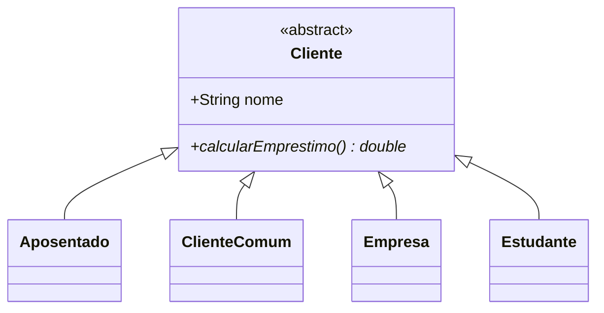
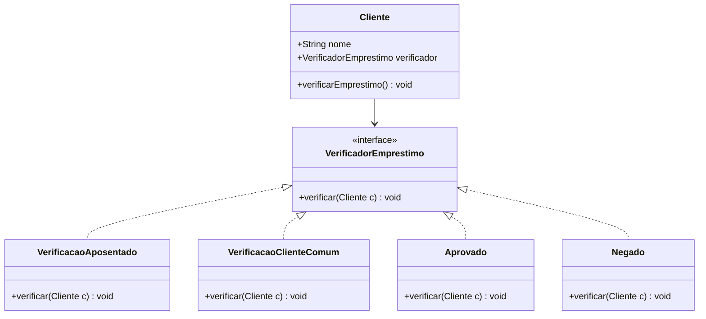

# Diagramas de Classe

### Anti-padrão (Herança)
Nesse modelo a classe Cliente obriga todo mundo a ter o método de empréstimo, mesmo quem não pode.

---

### Padrão Strategy
Aqui a lógica de verificação foi separada em uma interface. O Cliente só "usa" o verificador que ele precisar.

