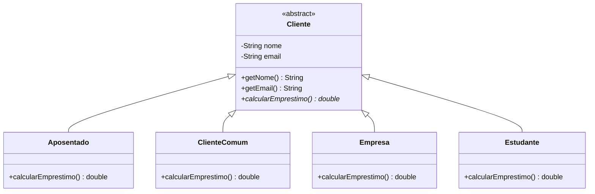
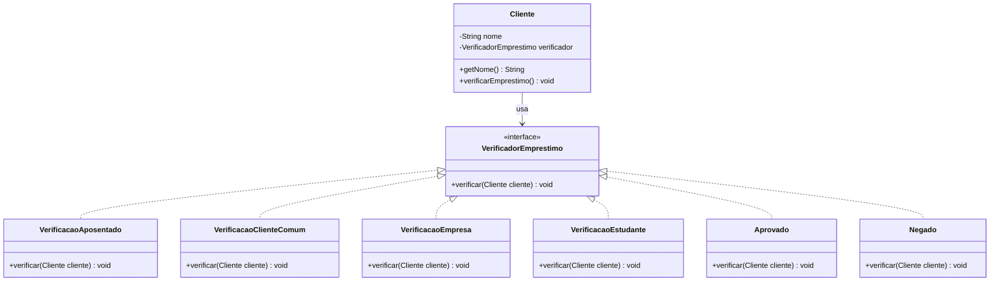

# Diagramas UML - Padrão de Projeto Strategy

Este documento apresenta os diagramas UML para a implementação do anti-padrão e do padrão Strategy encontrados neste projeto.

## 1. Anti-padrão (Herança Rígida)

No anti-padrão, a classe base `Cliente` força todas as subclasses a implementarem o método `calcularEmprestimo()`, mesmo que o comportamento não faça sentido para a maioria delas (lançando exceções).

---

## 2. Padrão Strategy

No padrão Strategy, o comportamento de verificação de empréstimo é encapsulado em uma interface (`VerificadorEmprestimo`). A classe `Cliente` (Contexto) possui uma referência para essa interface, permitindo que o comportamento seja trocado dinamicamente ou definido na criação.

### Vantagens da Solução com Strategy:
1.  **Princípio da Responsabilidade Única (SRP):** A lógica de verificação está separada da classe `Cliente`.
2.  **Princípio Aberto/Fechado (OCP):** Novos tipos de verificação podem ser adicionados sem alterar a classe `Cliente`.
3.  **Composição sobre Herança:** Evita a explosão de subclasses e a implementação de métodos desnecessários que lançam exceções.
